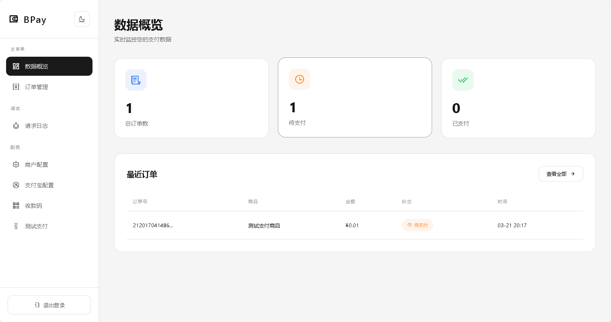
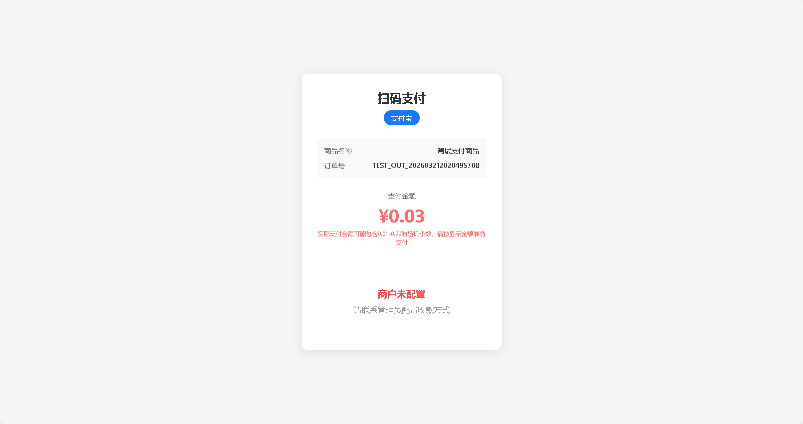
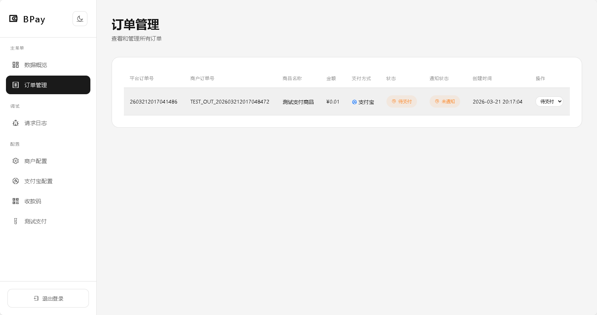

# 久寒支付监控系统

## 项目简介

久寒支付监控系统是一个集成了支付宝和微信支付监控的综合解决方案，采用GPL 3.0开源协议。该系统通过实时监控支付状态和余额变化，为商户提供及时的支付通知和管理功能。

## 界面预览

<table>
  <tr>
    <td align="center"><b>管理后台主页</b></td>
    <td align="center"><b>收银台页面</b></td>
  </tr>
  <tr>
    <td></td>
    <td></td>
  </tr>
  <tr>
    <td colspan="2" align="center"><b>订单管理</b></td>
  </tr>
  <tr>
    <td colspan="2" align="center"></td>
  </tr>
</table>

## 项目目的

- 解决个人资质限制问题，支持个人用户接入支付宝和微信支付，无需资质认证
- 提供多种支付方式支持，包括支付宝当面付和扫码支付
- 实现自动监控和通知，减少人工干预
- 提供直观的管理界面，方便商户配置和查看支付状态

## 核心功能

1. **支付宝余额监控**：实时监控支付宝余额变化，通过余额差额判断收到的金额并发送通知
2. **微信支付监控**：通过OCR技术识别微信支付二维码和支付结果
3. **支付宝当面付**：支持支付宝当面付功能，通过开放平台API生成订单，提供更快速的支付体验
4. **轮询API**：通过轮询机制实时检查支付状态
5. **支付方式自动选择**：根据商户配置自动选择最优支付方式（当面付优先）
6. **管理后台**：提供直观的管理界面，支持配置管理、订单查询、日志查看等功能
7. **测试模式**：支持测试订单，方便开发和调试
8. **主题切换**：支持暗黑/明亮两种主题模式

## 项目结构

```
├── 久寒支付监控.py       # 主监控程序（Python GUI）
├── bpay/                # 支付处理后端（PHP）
│   ├── admin/           # 管理后台
│   │   ├── header.php   # 后台页面头部
│   │   ├── index.php    # 后台首页
│   │   ├── login.php    # 登录页面
│   │   ├── logout.php   # 登出页面
│   │   └── test_pay.php # 测试支付页面
│   ├── api/             # API接口
│   │   ├── balance_notify.php # 余额通知接口
│   │   ├── logs.php     # 日志接口
│   │   ├── notify.php   # 支付通知接口
│   │   └── query_order.php # 订单查询接口
│   ├── lib/             # 库文件
│   │   ├── AlipayApp.php # 支付宝应用支付类
│   │   └── Logger.php   # 日志处理类
│   ├── assets/          # 静态资源
│   │   └── images/      # 图片资源（收款码等）
│   ├── config.php       # 配置文件
│   ├── db.php           # SQLite数据库操作类
│   ├── pay.php          # 支付页面
│   ├── submit.php       # 订单提交处理
│   ├── test_notify.php  # 测试通知页面
│   └── test_success.php # 测试成功页面
├── Umi-OCR/             # OCR相关功能（引用自开源项目）
├── README.md            # 项目说明文档
└── LICENSE              # GPL 3.0许可证
```

## 工作原理

1. **余额监控原理**：
   - 通过支付宝API获取当前余额
   - 与上次记录的余额进行比较
   - 计算余额增加额（忽略减少情况）
   - 将增加额作为收到的支付金额进行处理
   - 发送支付通知

2. **支付流程**：
   - 用户提交支付请求
   - 系统生成订单并显示支付二维码或当面付信息
   - 系统通过轮询API实时检查支付状态
   - 支付成功后发送通知并跳转到回调页面

3. **支付方式选择**：
   - 优先使用当面付（如果配置了支付宝开放平台应用）
   - 其次使用扫码支付（如果上传了收款码）
   - 如果都未配置，提示商户未配置支付方式

## 部署教程

### 环境要求

- PHP 7.0+
- SQLite 3+
- Python 3.6+（用于运行监控程序）
- Web服务器（Apache/Nginx）

### 安装步骤

1. **获取项目**：
   - 下载项目文件并解压到本地目录
   - 进入项目目录

2. **配置数据库**：
   - SQLite数据库会自动创建，无需手动配置
   - 系统会在首次运行时自动生成数据库文件和表结构
   - 默认管理密码：admin123

3. **配置支付宝**：
   - 登录管理后台：`http://yourdomain/bpay/admin/login`
   - 进入「支付宝配置」页面
   - 配置支付宝开放平台应用信息（APPID、私钥、公钥）
   - 或上传Python工具生成的服务端配置JSON文件自动录入
   - 配置回调地址（确保外网可访问）

4. **配置微信**：
   - 进入「收款码」页面
   - 上传微信收款码图片
   - 在 `久寒支付监控.py` 中配置微信相关参数
   - 确保OCR功能正常运行

5. **配置Web服务器**：
   - 将 `bpay` 目录部署到Web服务器
   - 配置伪静态规则

### 伪静态配置

#### Nginx配置

```nginx
location /bpay/ {
    try_files $uri $uri/ $uri.php?$query_string;
}

location /bpay/api/ {
    try_files $uri $uri/ $uri.php?$query_string;
}
```

#### Apache配置

```apache
<Directory "/path/to/bpay">
    Options FollowSymLinks
    AllowOverride All
    Require all granted
</Directory>
```

同时在 `bpay` 目录下创建 `.htaccess` 文件：

```
RewriteEngine On
RewriteCond %{REQUEST_FILENAME} !-f
RewriteCond %{REQUEST_FILENAME} !-d
RewriteRule ^(.*)$ $1.php [QSA,L]
```

### 默认登录信息

- **管理后台地址**：`http://yourdomain/bpay/admin/login`
- **默认密码**：admin123

> 登录后请立即修改默认密码

### 配置说明

1. **支付宝配置**：
   - 可在管理后台手动配置
   - 或使用Python生成的服务端配置JSON文件自动录入
   - 支持三种支付模式：自动选择、仅当面付、仅收款码

2. **微信配置**：
   - 在管理后台上传微信收款码图片
   - 在 `久寒支付监控.py` 中配置OCR相关参数
   - 配置微信监听和通知参数

3. **轮询设置**：
   - 默认轮询间隔为3秒
   - 可根据实际情况调整

4. **日志设置**：
   - 在管理后台可开启/关闭请求日志记录
   - 关闭日志可提高系统性能

## 使用说明

1. **启动监控**：
   - 运行 `久寒支付监控.py`
   - 在GUI界面中配置微信和支付宝参数
   - 点击开始监控按钮

2. **发起支付**：
   - 访问 `http://yourdomain/bpay/pay?trade_no=xxx`
   - 系统会自动选择支付方式（优先当面付）
   - 扫描二维码或点击链接完成支付

3. **查看订单**：
   - 登录管理后台
   - 在「订单管理」页面查看所有订单状态
   - 可手动更新订单状态

4. **测试支付**：
   - 访问 `http://yourdomain/bpay/admin/test_pay`
   - 提交测试订单
   - 查看支付流程和通知

5. **查看日志**：
   - 登录管理后台
   - 在「请求日志」页面查看所有请求和响应记录
   - 支持按日期和类型筛选

## 技术特点

1. **轻量级数据库**：使用SQLite数据库，无需复杂配置，自动初始化
2. **多支付方式**：支持支付宝当面付和收款码，微信收款码
3. **自动支付方式选择**：根据配置自动选择最优支付方式
4. **轮询机制**：实时检查支付状态，确保及时通知
5. **响应式设计**：支持不同设备访问，界面美观
6. **主题切换**：支持暗黑/明亮两种主题模式
7. **跨浏览器兼容**：支持Safari、Chrome、Firefox等主流浏览器
8. **安全可靠**：使用JWT认证，数据加密传输

## 常见问题

1. **余额监控不准确**：
   - 检查支付宝API权限是否正确
   - 确保网络连接稳定
   - 避免同时多笔交易导致余额变动较大

2. **支付通知未收到**：
   - 检查回调地址是否可外网访问
   - 查看日志文件了解具体错误
   - 确认支付宝/微信配置正确

3. **OCR识别失败**：
   - 确保Umi-OCR目录存在且可正常运行
   - 调整OCR识别参数
   - 确保屏幕分辨率和截图区域设置正确

4. **Safari浏览器上传失败**：
   - 系统已优化Safari浏览器兼容性
   - 确保使用最新版本的Safari浏览器
   - 尝试使用拖拽方式上传文件

5. **当面付配置失败**：
   - 检查支付宝开放平台应用是否已开通当面付权限
   - 确保私钥和公钥配置正确
   - 检查网络连接是否正常

## 许可证

本项目采用 GNU General Public License v3.0 开源协议。详见 [LICENSE](LICENSE) 文件。

## 贡献

欢迎提交Issue和Pull Request，共同改进项目。

## 联系方式

如有问题或建议，请联系作者：久寒

## 开源引用

本项目使用了以下开源项目：

- **Umi-OCR**：开源OCR工具，用于微信支付二维码识别
  - 项目地址：https://github.com/hiroi-sora/Umi-OCR
  - 许可证：MIT License